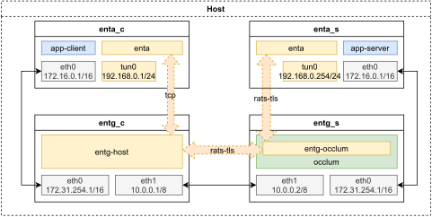

# About the demo

## Explanation

We have designed a simple demo.

In this demo, we create four isolated network environments (enta_c, entg_c, entg_s, enta_s) on the host by using the network namespace mechanism to simulate four independent hosts. The physical links between the two adjacent ones are simulated using veth pair. The architecture is as follows.



In entg_s, we run entg in the occlum environment and use `sgx_ecdsa` as attester to establish rats-tls channels with entg_c and enta_s.

> Note that the `sgx_ecdsa` mode of rats-tls requires both the attester and verifier's environment are able to connect to the PCCS Server.

In this demo, we run the unmodified echo client and echo server programs on enta_c and enta_s respectively. They are the counterparts of app-client and app-server in the above diagram.


The relevant code can be found in the `scripts` directory. Among them, `demo_setup_netns.sh` is used to initialize the simulated network environment, and `run_demo_tmux.sh` contains commands to setup the enta and entg and echosvr.

## Run the demo

The demo can be prepared and run directly with the following command
```sh
make demo
```
