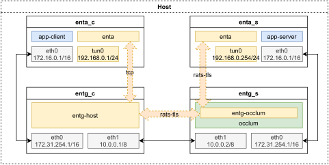

# 关于demo

## 解释

项目附带了一个最简的demo。

在该demo中，我们使用network namespace机制在主机上创建4个隔离的网络环境(enta_c、entg_c、entg_s、enta_s)来模拟四台独立的主机，相邻的两者之间的物理链路使用veth pair模拟。整体结构如下：



为了验证rats-tls的效果，在entg_s中，我们将entg运行在occlum环境里，使用`sgx_ecdsa`作为attester，使其与entg_c和enta_s建立rats-tls通道。

> 需要注意的是，rats-tls的`sgx_ecdsa`模式要求attester和verifier的环境具有访问PCCS Server的能力，上图中省略了netns通过host出网的部分。

作为验证，在该demo中，我们在enta_c和enta_s上分别运行未经修改的echo client程序和echo server程序，分别对应上面的app-client和app-server。


相关的代码可以在scripts目录下找到。其中，`demo_setup_netns.sh`用于初始化模拟的网络环境，`run_demo_tmux.sh`中包含了运行enta和entg以及echosvr程序的命令

## 运行demo

可以直接使用以下命令准备并运行demo
```sh
make demo
```

这将启动一个tmux会话，初始化上述模拟的网络环境，并运行一对echosvr作为测试。

